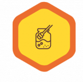
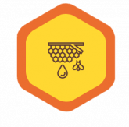

# entregaFinalDW

pedacitos de codigo 
        

            <h1 class=" fw-bold position-absolute top-50 start-50 text-center translate-middle text-white">Cooperativa Apícola   "La Colmena"</h1>
        

        
<section class="container"> <!--Primera seccion Index-->
            <h2 class="fw-bold py-3">Producimos</h2>
            

                

                    

                        <article class="card border-0 text-center">
                            
 
                                
 Miel

                            

                            
                        </article>
                    

                    

                        <article class="card border-0 text-center ">
                            
 
                                
 Polen

                            

                            
                        </article>
                    

                    

                        <article class="card border-0 text-center">
                            
 
                                
Propóleo

                            

                            
                        </article>
                    

                

            

        </section>
        

        <section  class="container">   <!--Segunda Seccion del Index-->
            <h2 class="py-3 fw-bold">Contamos con</h2> 
            
 
                

                    

                        <article class="card border-0 text-center">
                            
                            
 Somos 47 socios

                        </article>
                    

                    

                        <article class="card border-0  text-center">
                            
                            
 Más de 10.000 colmenas  en apiarios propios

                        </article>
                    

                    

                        <article class="card border-0 text-center">
                            
                            
 Más de 1.500   kilos anuales

                        </article>
                    

                

            

        </section>